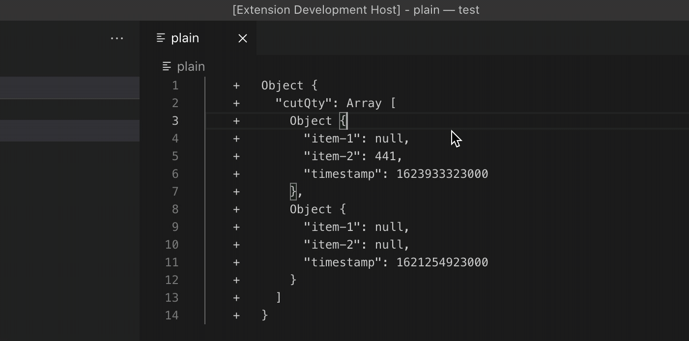

# Jest Diff Parser

This extension converts your Jest diffs into actual JSON. Just copy your test output into the editor, select the part you want to convert, and run the `Jest Diff: Parse Selection` command.

## How does it work?

The extension ships with a small Go binary which acts as a language server and implements a single request `$/formatJestDiff`. No other language server features are used here, and implementing a language server to achieve this is a bit overkill.
